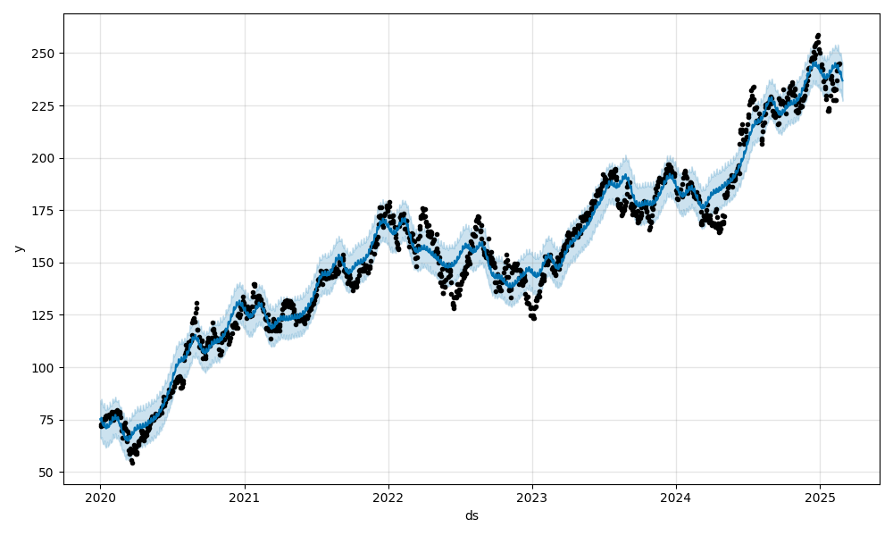
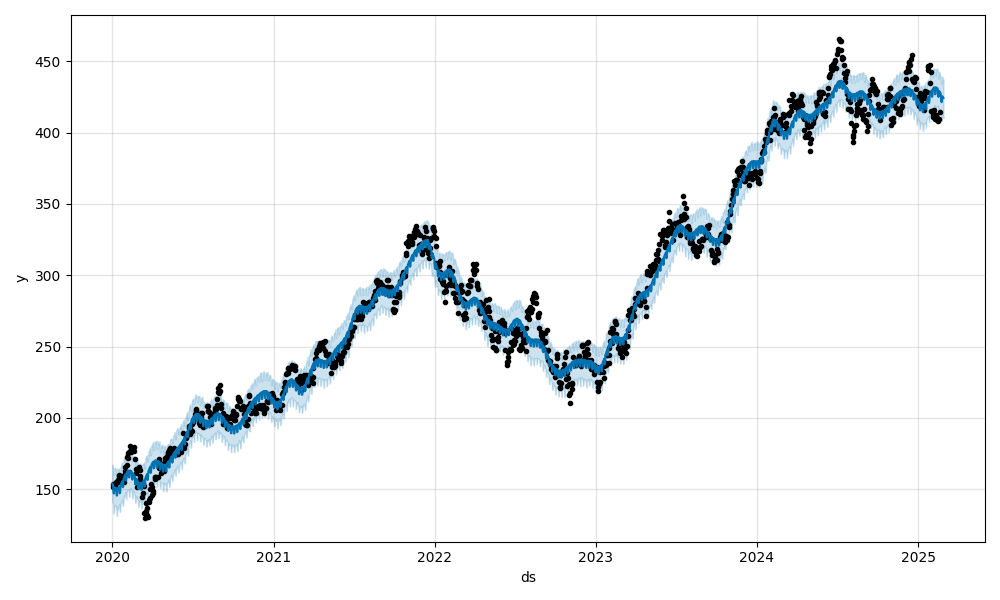
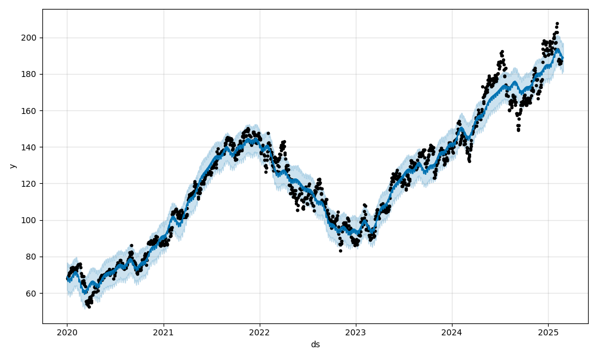
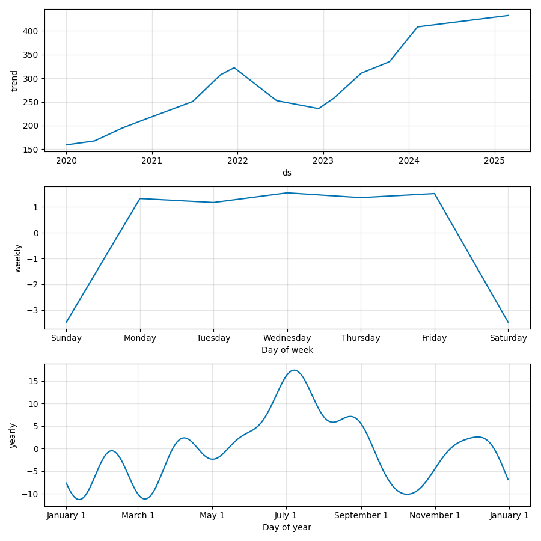

# 🧠 MLServe - FastAPI ML Model Deployment

🚧 UNDER ACTIVE DEVELOPMENT 🚧

## 📑 Table of Contents  
- [🚀 Overview](#-overview)  
- [📌 Features](#-features)  
- [🏗️ Architecture](#%EF%B8%8F-architecture)
- [🛠️ Installation](#%EF%B8%8F-installation ) 
  - [1️⃣ Clone the Repository](#1️⃣-clone-the-repository)  
  - [2️⃣ Install Dependencies](#2️⃣-install-dependencies)  
  - [3️⃣ Run FastAPI Server](#3️⃣-run-fastapi-server)  
  - [4️⃣ Test API](#4️⃣-test-api)  
- [🐳 Docker Setup](#-docker-setup)  
  - [1️⃣ Build the Docker Image](#1️⃣-build-the-docker-image)  
  - [2️⃣ Run the Container](#2️⃣-run-the-container)  
- [📡 API Endpoints](#-api-endpoints)  
  - [🔹 Root Endpoint](#-root-endpoint)  
  - [🔹 Predict](#-predict)  
- [📊 Prediction Charts](#-prediction-charts)  
  - [📊 AAPL](#apple-aapl)
  - [📊 MSFT](#microsoft-msft)
  - [📊 GOOG](#google-goog)
  - [📌 Interpreting the Prediction Charts](#-interpreting-the-prediction-charts)  
- [🧠 Machine Learning Model Details](#-machine-learning-model-details)  
  - [📊 Sample Forecast Visualization](#-sample-forecast-visualization)  
  - [📌 Trend and Seasonality Components](#-trend-and-seasonality-components)  
  - [🔍 Understanding the Forecast](#-understanding-the-forecast)  
- [🚀 Future Enhancements](#-future-enhancements)  

---

## Overview

This project demonstrates how to **serve a machine learning model** using **FastAPI** and **Docker** into production as a RESTful API using FastAPI. The API allows users to send data and receive stock price predictions using [Prophet](https://facebook.github.io/prophet/) ML model.

##  Features

*   **FastAPI-based REST API** for serving ML predictions.
*   **Dockerized deployment** for easy scalability.
*   **Asynchronous request handling** for efficient inference.
*   **Model versioning and logging** to track performance.
*   **CI/CD integration** (future enhancement) for automated deployments.

##  Architecture

1.  **Pretrained ML Model** – A trained model is saved and loaded for inference.
2.  **FastAPI Backend** – Exposes RESTful endpoints for making predictions.
3.  **Docker Containerization** – The application runs inside a container for portability.
4.  **(Optional) Cloud Deployment** – Can be deployed on AWS/GCP/Azure using Kubernetes or serverless functions.

## Installation

### 1️⃣ Clone the repository

    git clone https://github.com/yourusername/fastapi-ml-deploy.git
    cd fastapi-ml-deploy
    

### 2️⃣ Install dependencies

    pip install -r requirements.txt
    

### 3️⃣ Run FastAPI server

    uvicorn app.main:app --host 0.0.0.0 --port 8008 --reload
    

### 4️⃣ Test API

Open your browser and visit:

    http://127.0.0.1:8008/docs
    

## 🐳 Docker Setup

### 1️⃣ Build the Docker image

    docker build -t fastapi-ml-app .
    

### 2️⃣ Run the container

    docker run -p 8000:8000 fastapi-ml-app
    

## 📡 API Endpoints

### 🔹 Predict

    POST /predict/
    

**Request Body:**

    {
        "ticker": "AAPL"
        
    }
    

**Response:**

    {
        "ticker": "AAPL",
        "forecast": 
        [
              {
                  "ds": "2025-02-22T00:00:00",
                  "trend": 244.01168239424806,
                  "yhat_lower": 232.09980241706867,
                  "yhat_upper": 249.23639821076168,
                  "trend_lower": 244.01168239424806,
                  "trend_upper": 244.01168239424806,
                  "additive_terms": -2.6701240826347483, 
                  .......
              },
              {
                  "ds": "2025-02-23T00:00:00",
                  "trend": 244.1718582137145,
                  "yhat_lower": 232.24244874958652,
                  "yhat_upper": 249.32422233689414,
                  "trend_lower": 244.1718582137145,
                  "trend_upper": 244.1718582137145,
                  "additive_terms": -3.333045887720604,
                  ......
              },
              .....
        ]
    }

## 📊 Prediction Charts

Here are sample stock price predictions generated using the **Prophet** model:

### Apple (AAPL)

### Microsoft (MSFT)

### Google (GOOG)

### 📊 Interpreting the Prediction Charts

When generating stock price forecasts using Prophet, the visualization includes:

- **⚫ Black Dots (y)** → Actual historical stock prices used for training.
- **🔵 Blue Line (ŷ or yhat)** → The model’s predicted stock price (**yhat**).
- **🔹 Shaded Light Blue Area** → The confidence interval, representing the expected range of price fluctuations:
  - **Upper Bound (yhat_upper)** → Maximum expected price.
  - **Lower Bound (yhat_lower)** → Minimum expected price.

📌 **Trend and Seasonality Components**:
The model also breaks down the stock price into **trend** and **seasonality effects** which is covered in the next section.

## 🧠 Machine Learning Model Details

The model used in this project is **Facebook Prophet**, which forecasts stock prices based on historical market data. It generates time-series predictions, showing both **trends** and **seasonal effects**.

### 📊 Sample Forecast Visualization

Here’s an example of how the model predicts stock prices over time:

| Date        | Predicted Price ($) |
|------------|--------------------|
| 2025-02-20 | 190.12 |
| 2025-02-21 | 191.45 |
| 2025-02-22 | 192.78 |

---

### 📌 **Trend and Seasonality Components**
Prophet decomposes the time-series data into **three main components**:

1. **Trend** – The overall direction of the stock price over time.
2. **Seasonality** – Repeating patterns at daily, weekly, or yearly intervals.
3. **Holidays/Events** – External factors that impact stock prices.

Here’s an example of the **trend and seasonal effects** visualized for MSFT:

---

### 🔍 **Understanding the Forecast**
- The **blue line** represents the predicted stock price.
- **Seasonality plots** (daily, weekly, yearly) reveal recurring patterns.

These insights can help traders and analysts make **informed investment decisions**. 🚀

## 🚀 Future Enhancements

*   ✅ **Deploy on Kubernetes** using Minikube or cloud providers.
*   ✅ **Implement batch predictions** for processing large datasets.
*   ✅ **Add authentication & API rate limiting** for security.
*   ✅ **CI/CD pipeline** to automate testing & deployment.
